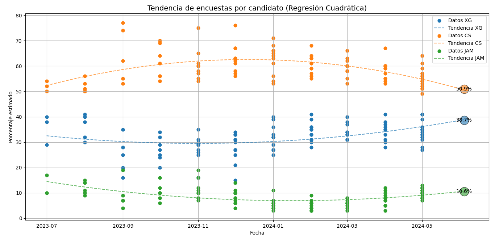

  <h1 style="text-align: center; color: #2c3e50;">
    🗳️ Predicción de la Elección Presidencial de México 2024 mediante Algoritmos de Regresión con Machine Learning en Python
  </h1>

  

    Este proyecto utiliza diferentes algoritmos de regresión desarrollados con técnicas de <strong>aprendizaje automático supervisado</strong> en Python para predecir al candidato ganador de la elección presidencial de México, celebrada el <strong>2 de junio de 2024</strong>. La predicción se basa en datos de encuestas recopiladas desde <strong>julio de 2023</strong> hasta <strong>mayo de 2024</strong>. Además, se realiza una comparación entre los resultados estimados por el modelo y los resultados oficiales obtenidos el día de la elección.
  

  

  <h2 style="color: #2980b9;">🎯 Predicciones para el 2 de junio de 2024:</h2>
  
  <ul style="color: #34495e;">
    <li>Claudia Sheinbaum Pardo: <strong>58.30%</strong></li>
    <li>Bertha Xóchitl Gálvez Ruíz: <strong>32.94%</strong></li>
    <li>Jorge Álvarez Máynez: <strong>8.56%</strong></li>
  </ul>

  

    ✅ <strong>Ganador previsto:</strong> Claudia Sheinbaum Pardo con 58.30%
  

  

  <h3 style="color: #16a085;">📈 Predicción con Regresión Lineal</h3>
  

  <h3 style="color: #c0392b;">📈 Predicción con Regresión Cuadrática</h3>
  

  

  <h2 style="color: #2980b9;">✅ Porcentaje de votos de los valores reales y los valores predichos</h2>

  <h4 style="color: #34495e;">🟢 Reales</h4>
  <ul>
    <li>Claudia Sheinbaum Pardo: <strong>59.3577%</strong></li>
    <li>Bertha Xóchitl Gálvez Ruiz: <strong>27.9056%</strong></li>
    <li>Jorge Álvarez Máynez: <strong>10.4187%</strong></li>
  </ul>

  <h4 style="color: #34495e;">🟠 Predichos</h4>
  <ul>
    <li>Claudia Sheinbaum Pardo: <strong>58.30%</strong></li>
    <li>Bertha Xóchitl Gálvez Ruiz: <strong>32.94%</strong></li>
    <li>Jorge Álvarez Máynez: <strong>8.56%</strong></li>
  </ul>

  

  <h2 style="color: #8e44ad;">📊 Utilicé la métrica de Error Absoluto Medio en el Algoritmo de Regresión Lineal para evaluar el rendimiento del modelo, y sus resultados fueron estos:</h2>
  <ul style="color: #34495e;">
    <li>Xóchitl Gálvez MAE de <strong>3.92</strong></li>
    <li>Claudia Sheinbaum MAE de <strong>4.77</strong></li>
    <li>Jorge Máynez MAE de <strong>2.36</strong></li>
  </ul>

  

    El MAE es una métrica que calcula el promedio de la diferencia absoluta entre los valores reales y los valores predichos, sin importar si fueron sobrestimados o subestimados. Cuanto menor es el MAE, mejor es la precisión del modelo.
  

  

    En este caso, el modelo tuvo su menor error al predecir a <strong>Jorge Máynez</strong>, seguido de <strong>Xóchitl Gálvez</strong>, y con un mayor error en el caso de <strong>Claudia Sheinbaum</strong>. Aunque los valores predichos de Sheinbaum se aproximan bastante a su resultado real, el MAE refleja una mayor variabilidad en las encuestas, lo cual impacta el ajuste del modelo.
  

  

  <h2 style="color: #2980b9;">📝 Nota</h2>
  

    Se utilizó el algoritmo de <strong>regresión lineal</strong>, que fue el más eficaz debido a que el algoritmo de <strong>regresión cuadrática</strong> tendía a sobreajustar los datos. Aunque la regresión cuadrática es más flexible y puede capturar curvaturas, en este caso introdujo variaciones no realistas en los extremos del periodo analizado. La tendencia de las encuestas para cada candidato fue, en términos generales, aproximadamente lineal a lo largo del tiempo, por lo que la regresión lineal resultó en predicciones más estables y cercanas a los resultados reales, evitando el sobreajuste que la regresión cuadrática mostró en los últimos meses.
  

  

  <h2 style="color: #16a085;">🔎 Observaciones</h2>
  

    El modelo sobrestimó significativamente a <strong>Xóchitl Gálvez</strong>, lo que pudo haber sido resultado de una tendencia inflada en las encuestas previas a mayo de 2024, posiblemente debido a sesgos de respuesta o encuestadoras afiliadas.
  

  

    Se observa una tendencia a la baja en los porcentajes de Xóchitl en los últimos meses, lo cual sugiere que votantes indecisos migraron a otras opciones, en especial a <strong>Jorge Máynez</strong>, quien mostró un crecimiento constante y estable hacia el final del periodo.
  

  

    Aunque el MAE indica que la predicción de Máynez fue la más precisa, esto también puede explicarse por la menor varianza en las encuestas sobre su candidatura, lo cual facilitó el aprendizaje del modelo.
  

  

    En el caso de <strong>Claudia Sheinbaum</strong>, el modelo predijo correctamente su victoria con un margen pequeño de error. Aunque el MAE es mayor en su caso, esto se debe en parte a la alta dispersión de datos en las encuestas, no necesariamente a una mala predicción general.
  

  

  <h2 style="color: #c0392b;">✅ Conclusión</h2>
  

    Tomando en cuenta el análisis del gráfico y la evaluación cuantitativa, se concluye que el modelo de <strong>regresión lineal</strong> aplicado fue capaz de capturar con buena precisión las tendencias generales de los candidatos, especialmente con <strong>Máynez</strong> y <strong>Sheinbaum</strong>. La sobrestimación de <strong>Xóchitl Gálvez</strong> revela una limitación común en modelos predictivos basados en encuestas: el posible sesgo en los datos de entrada.
  

  

    Además, este modelo no contempló explícitamente a los votantes indecisos, cuya decisión final probablemente influyó en el ajuste de las proporciones, especialmente en el descenso de Xóchitl y el crecimiento de Máynez. No se detectan anomalías significativas entre los resultados reales y predichos que sugieran fraude electoral. Por lo tanto, los resultados predichos reflejan adecuadamente la realidad, y cualquier diferencia puede atribuirse a cambios legítimos en la intención de voto durante los últimos meses antes de la elección.
  

